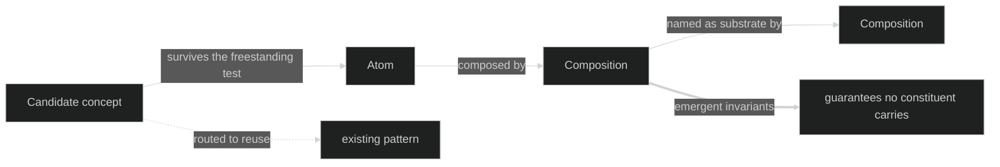

# The Corpus

The library itself, and the one page that states its lattice — the four terms everything below is organized by, defined nowhere else and implied everywhere:

- A **concept** is the unit of separation (Jackson's word, and this library's): one purpose, its own state, actions, and invariants, specifiable without naming anything else.
- An **atom** is a concept realized in this library — freestanding, stored flat, naming no other pattern.
- A **composition** is the wiring of concepts, never a new concept — it names atoms (or other compositions, as substrates) and owns only the emergent guarantees that appear when they work together.
- A **candidate concept** is a proposal that has not yet survived triage — promoted to an atom by the freestanding test, or routed to reuse. It never outlives that decision.

The lattice, argued interactively: [**Undoing Undos**](./three-undos.html) — one input stream, three engines, three shapes of the past, and therefore three concepts rather than one with options. Two of its three are grounded patterns ([Undo History](./compositions/undo-history.md), reversing by replay-skip; [Compensable Workflow](./compositions/compensable-workflow.md), reversing by compensating action); the third — branching undo — is a candidate concept that has not yet faced the freestanding test. The exhibit demonstrates every state of the lattice by accident, which is the best way.

The pages below are the lattice populated: the two catalogs, the graph that renders their edges, the format every entry conforms to, and the strict definitions for the handful of English words the specs lean on.
